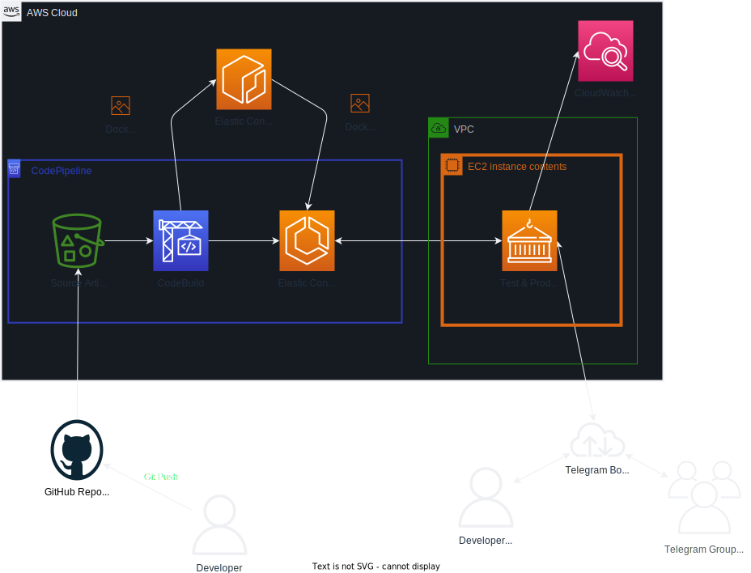

# RoastGPT

RoastGPT is a Telegram bot that roasts targeted users in a chat group. When a target user sends a message, ChatGPT is used to determine if the message is sufficiently mean to warrant a comeback in retaliation. If it is, ChatGPT is then used to generate a roast/comeback towards the target user.

This was built as a fun project for a group chat with friends.

## Sample


## CI/CD Deployment Pipeline



## Building

First you will need to create a `.env` file to set the Telegram Bot API key, Open AI API key, target usernames, and target chat ids:

```Dotenv
TELEGRAM_TOKEN = "INSERT TELEGRAM TOKEN HERE"
OPENAI_TOKEN = "INSERT OPEN AI API TOKEN HERE"
TARGET_USERNAMES = ["username1", "username2"]
TARGET_CHAT_ID = [-100987654321]
```

Ensure that you have Docker installed, then run this command to build the Docker image.

```bash
docker build -t roast-gpt .
```

## Usage

```bash
docker run roast-gpt
```

### Without Docker

```bash
pipenv lock
pipenv run python main.py
```

## Contributing

Pull requests are welcome. For major changes, please open an issue first
to discuss what you would like to change.

Particularly, any prompt improvements are welcome.
